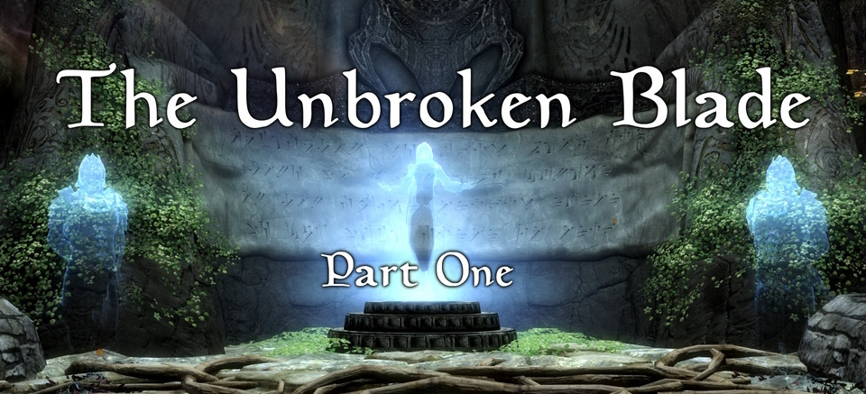

# The Unbroken Blade: Part 1 (Script Repository)

[Papyrus](https://www.creationkit.com/index.php?title=Category:Papyrus) source code for [The Unbroken Blade: Part 1](https://www.nexusmods.com/skyrimspecialedition/mods/80571), including the relevant `.esp` file and dialogue view files.

The mod's assets (including compiled versions of these scripts) can be found at [Nexus Mods](https://www.nexusmods.com/) for either Skyrim LE or Skyrim SE/AE. All information including changelogs, issues and user interactions are hosted on [Nexus Mods](https://www.nexusmods.com/skyrimspecialedition/mods/80571).

This is a modder's resource only, downloading these files will have no effect when running the mod.

## Notes
 - These scripts are to be used in conjunction with the Skyrim [Creation Kit](https://www.creationkit.com/index.php?title=Main_Page).
 - All scripts are prefixed with `_arc`. This is to distinguish them from other mods or vanilla files.
 - No scripts overwrite vanilla objects, therefore compatibility is very high. Please open an issue if you experience a mod conflict.
 - A small number of scripts extend vanilla objects utilizing some odd & creative methods. Thus compatibility cannot be guaranteed (albiet very high). Especially if other obscure mods modify the vanilla / base scripts in unexpected ways. I have done everything possible to assure compatibility with common / popular / requested mods thus far.
 - All scripts, except for a small amount (<10), are heavily optimized, and best practices are implemented. Due to this optimization, some aspects may seem cryptic, in which case comments have been added.
 - When copying to the `DialogueViews` directory, I recommend **not** overwriting existing files when prompted.
- Only the SE/AE version of the `.esp` file is included. The Skyrim LE Creation Kit can be used to convert it to from form version `43` to `42` if needed.
